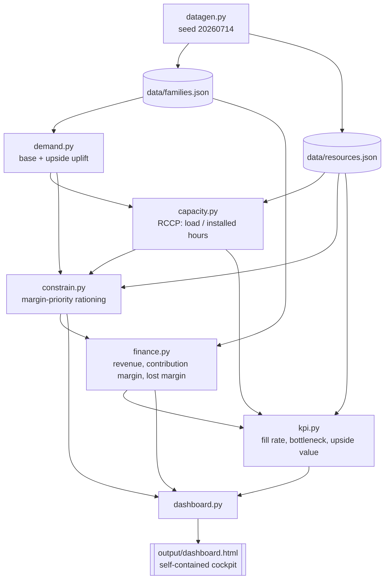

# S&OP Integrated Planning — an executable S&OP → IBP cockpit

**A Sales & Operations Planning / Integrated Business Planning cockpit that turns a demand plan into a Rough-Cut Capacity Planning (RCCP) check, a constrained supply plan, a financial reconciliation, and a self-contained interactive HTML dashboard — so the cost of *not* funding a bottleneck shows up as a real computed dollar figure, not a hunch in a meeting.**

[](https://www.python.org/)
[](#60-second-quickstart)
[](tests/)
[](LICENSE)

## The takeaway in one line

> **The cost of *not* investing in capacity is a computed number — and it is exactly equal to the value of investing in it. S&OP exists to make that trade-off explicit before the capex meeting, not after.**

This repo is a small, runnable demonstration of that reconciliation. A synthetic appliance manufacturer's demand plan is checked against installed capacity with standard Rough-Cut Capacity Planning (RCCP, MRP-II/APICS practice), then run three ways — the plan already agreed to (Base), the plan if an upside is funded (Upside), and the plan if it isn't (Constrained). The arithmetic proves the identity: **`upside value unlocked` = `margin at risk if not funded` = $531,728.**

## Who this is for

Supply-chain practitioners and anyone who has sat in an S&OP meeting where sales wants to chase an upside and operations has to say whether the plant can actually build it. This is not an optimizer and not a production tool — it is a **transparent, hand-checkable demonstration** of the reconciliation that S&OP/IBP performs, with every number traceable back to arithmetic you can verify in a spreadsheet.

**Zero dependencies. Zero API keys. Runs in 60 seconds.**

---

## See it

The built `output/dashboard.html` is fully self-contained — open it and drag a lever; the numbers recompute client-side. *(A static screenshot is a TODO — headless capture of the dark IBCS canvas renders black on some macOS setups; open the file to see it live.)*

## 60-second quickstart

```bash
cd sop-integrated-planning
make demo             # generate seeded data, run 3 scenarios, build dashboard
open output/dashboard.html
```

No `pip install` required — the entire engine is Python 3.10+ standard
library. `make demo` is equivalent to `PYTHONPATH=src python3 -m
sop_integrated_planning demo`.

Real console output from a live run (`make demo` still prints the code's
legacy label "Gross margin"; it is **contribution margin** — see the
KPI reference below):

```
Generating seeded Cascade Appliances dataset...
  wrote data/families.json
  wrote data/resources.json

Scenario comparison — Cascade Appliances (synthetic)
Metric                          Base        Upside   Constrained
----------------------  ------------  ------------  ------------
Fill rate                     100.0%        100.0%         99.1%
Revenue                 $127,687,935  $148,472,953  $147,221,512
Contribution margin      $52,203,890   $60,625,548   $60,093,820
Lost revenue                      $0            $0    $1,251,441
Lost margin                       $0            $0      $531,728
Ending inventory value    $8,421,000    $8,421,000    $7,375,800

Capacity — peak utilization by resource (Upside demand plan)
Resource                 Installed hrs/mo  Peak utilization
-----------------------  ----------------  ----------------
Assembly Line A (heavy)             9,500       115.0% OVER
Assembly Line B (light)             7,800             57.8%
Test / QA                           2,220             95.3%
Packaging                           1,600             90.0%

Exec takeaway
  Bottleneck: Assembly Line A (heavy) (RES-LINEA) peaks Apr — exceeds installed capacity — 115.0% of installed capacity
  Upside value unlocked (if capacity is added): $531,728
  Margin at risk if not (constrained): $531,728 (concentrated in FAM-DRY)

Wrote:
  output/comparison.json
  output/dashboard.html
```

Run the test suite: `make test` (86 tests — 83 engine + 3 JS-port golden gates — `unittest`, no dependencies). The JS-port gate requires `node`; the engine and console need nothing beyond Python 3.10+.

---

## The interactive dashboard

`output/dashboard.html` is one self-contained file (inline CSS + vanilla JS + inline SVG, **zero CDN, zero API keys**). Beyond the three fixed scenarios, it is a live what-if cockpit:

- **Four anchor scenarios** — S0 Base, S1 Constrained, S2 Upside, S3 Custom (levers), plus a disabled S4 Invest (roadmap).
- **A live lever panel** — drag any lever and the dashboard recomputes *client-side* (a faithful JS port of the Python engine, golden-gated to 0 diffs):
  - volume multiplier, seasonality shift, per-family demand uplift
  - available hours per resource
  - unit price Δ, unit variable-cost Δ, opening inventory Δ
  - **rationing-rule selector** — throughput-per-constraint ▸ fair-share ▸ strategic-priority
- **Full drill-down** — KPI tiles, small-multiples grid, capacity utilization with the 100% line, structural comparison, a margin waterfall + bridge, and a 5-step provenance modal that traces any cell back through Demand → Capacity → Rationing → Supply → Financials.
- **Light/dark themes**, IBCS-style visual rules, AA contrast on every dark-theme token pair.

The lever panel runs entirely in the browser — the portability that makes it a portfolio artifact rather than just a script.

## The story

Every S&OP cycle eventually reaches the same conversation: sales wants
to chase an upside, and operations has to say whether the plant can
actually build it. Thomas Wallace and Robert Stahl's *Sales and
Operations Planning: The How-To Handbook* frames this as a five-step
monthly cycle ending in an executive meeting where demand and supply
get reconciled into one number everyone commits to; Oliver Wight's
*Transition from Sales and Operations Planning to Integrated Business
Planning* (2nd ed., 2022) and Palmatier & Crum's *Enterprise Sales and
Operations Planning* extend that reconciliation to include the
financial plan, not units alone. This repo is a small, runnable
demonstration of that reconciliation: a synthetic appliance
manufacturer's demand plan, checked against installed capacity with
standard Rough-Cut Capacity Planning (RCCP, MRP-II/APICS practice), run
three ways — the plan already agreed to, the plan if an upside is
funded, and the plan if it isn't — so the cost of *not* investing shows
up as a real, computed dollar figure rather than a hunch in a meeting.

### The three scenarios

Three scenarios, same seeded dataset, same demand overlay for Upside
and Constrained — differing only in whether the capacity gap gets
funded:

- **Base** — base demand vs. installed capacity. 100.0% fill rate
  everywhere; peak utilization 94.48% (Assembly Line A) — feasible with
  headroom, by construction.
- **Upside** — uplifted demand, capacity gap assumed funded. 100.0%
  fill rate, but Assembly Line A peaks at **114.98% utilization in
  April** against its 9,500 hrs/month install — the sole bottleneck
  (Test/QA next-closest at 95.34%, safely under). This is the emergent
  proof the model requires: no code asserts a bottleneck exists, it
  falls out of seasonality × uplift × hours-per-unit arithmetic.
- **Constrained** — same uplifted demand, capacity held at Base level.
  99.09% fill rate; Refrigerators and Washers stay fully protected all
  year, Dryers absorbs the entire shortfall (worst month: 57.95% fill
  in May). Full-year cost: **$531,728 lost margin**, **$1,251,441 lost
  revenue**, concentrated entirely in Dryers.

`upside_value_unlocked` ($531,728) is exactly equal to Constrained's
lost margin — the same dollar figure read two ways: what funding the
bottleneck is worth, and what not funding it costs. Full walkthrough:
[docs/05-scenario-guide.md](docs/05-scenario-guide.md).

The arc closes with the decision the cycle exists to inform. Once the
bottleneck and its $531,728 cost are on the table, the remaining
question is whether funding the capacity is worth it — and the
[Invest scenario story](docs/08-invest-scenario-story.md) works that
decision end to end: the ~3,073 hours/year that would clear the
constraint on Assembly Line A, priced two honest ways (an overtime
premium and a machine lease), each weighed against the margin it
protects. The model computes the margin side exactly; the cost of
capacity is the input. That is what S&OP buys: a capex decision that
is a cost comparison, not a hunch.

## Why this is different

- **No optimizer.** Every number is a hand-checkable rule — scenario +
  levers = parameter sweeps recomputed by *readable arithmetic* (a TOC
  heuristic, a rolling inventory balance, contribution-margin
  rationing). You can reproduce `$531,728` in a spreadsheet in an hour.
- **Transparency is the differentiator.** The demand→capacity→supply→
  financial trail is fully traceable per cell via the provenance modal.
- **Self-contained.** One HTML file, zero CDN, zero API keys, runs from
  a thumb drive.
- **Honest assumptions, documented.** See the [Method & Assumptions](docs/07-method-and-assumptions.md) note — this model is a point estimate, not a range; it excludes capex and fixed overhead; it does not build ahead or carry backorders. Each limitation is a named roadmap item, not a hidden gap.

## Architecture



## Feature tour

| Module | Concept | What it does |
|---|---|---|
| `datagen.py` | Seeded synthetic data | Generates "Cascade Appliances" — 6 product families, 4 shared production resources, seasonality-shaped demand — deterministically from seed `20260714` |
| `demand.py` | Unconstrained demand plan | Base monthly demand, plus a per-family upside uplift applied only in the Upside/Constrained scenarios |
| `capacity.py` | Rough-Cut Capacity Planning (RCCP) | Loads the demand plan against every resource's installed hours; flags any month/resource combination that clears 100% utilization |
| `constrain.py` | Constrained supply plan | Decides, per scenario, whether a capacity gap gets invested away (Upside) or rationed by descending unit margin (Constrained) |
| `finance.py` | Financial reconciliation | Turns the supply plan into revenue, contribution margin, lost revenue, lost margin, and ending inventory value — the IBP extension beyond units |
| `kpi.py` | KPI catalog | Fill rate, bottleneck utilization, contribution margin, lost margin, upside value unlocked — one flat dict, read identically by the CLI and the dashboard |
| `dashboard.py` | Self-contained HTML | One dashboard: KPI tiles, capacity utilization bar chart with a 100% line, demand-vs-supply chart, reconciliation table, exec-takeaway callout — inline CSS/JS/SVG, zero CDN |
| `cli.py` | `python -m sop_integrated_planning` | `plan` / `compare` / `demo` / `dashboard` — hand-rolled ANSI console tables, no formatting dependency |

## KPI reference

| KPI | Definition |
|---|---|
| **Fill Rate** | `shipped_units / demand_units`, across all families, full year |
| **Peak Utilization / Bottleneck** | `max(load_hours / monthly_available_hours * 100)` across every resource and month, always measured against installed capacity regardless of scenario |
| **Contribution Margin** | `shipped_units * (unit_price − unit_variable_cost)`, summed across families and months |
| **Lost Revenue / Lost Margin** | `unmet_units * unit_price` / `unmet_units * unit_margin` — real, rationed shortfall in the Constrained scenario |
| **Ending Inventory Value** | December-only closing inventory at variable cost (not summed across months, to avoid double-counting carried stock) |
| **Upside Value Unlocked** | `upside.total_contribution_margin − constrained.total_contribution_margin` — by construction, exactly equal to Constrained's lost margin |

Full formulas as implemented (not idealized): [docs/03-kpi-reference.md](docs/03-kpi-reference.md).

## Design decisions

- **RCCP utilization is always measured against installed capacity, in
  every scenario.** This is what makes the Upside bottleneck genuinely
  visible rather than assumed away — only `constrain.py` decides
  afterward whether the gap RCCP flagged gets invested (Upside) or
  rationed (Constrained).
- **Contribution-margin rationing, no invented floor.** When a resource
  is over capacity, `constrain.py` grants hours to the highest-margin
  family first, in full, before moving to the next — including down to
  zero for the lowest-margin user in a given month. No minimum-
  allocation rule was added; the brief specifies margin priority, not a
  fairness floor.
- **No backorders, no build-ahead.** `shipped = min(opening +
  produced, demand)`; `produced` is capped at that month's own demand.
  Unmet demand is a lost sale, not a promise deferred to next month —
  the simpler, more conservative reading of a single-stage monthly RCCP
  check, not a multi-period optimizer (see
  [docs/06-roadmap.md](docs/06-roadmap.md) for what a build-ahead
  extension would need).
- **Everything computed, nothing hardcoded.** The bottleneck, the fill
  rates, the lost-margin figure — all derived from `data/*.json` at run
  time. Edit `datagen.py`'s constants and every downstream number, in
  the console and the dashboard alike, changes accordingly (see
  [docs/01-architecture.md](docs/01-architecture.md)).

## What this does NOT do (honest limitations)

This is a transparent demo, not a production APS. It deliberately
omits, and each is a named roadmap item:

- **No optimizer** — it is a parameter-sweep simulator, not a solver.
- **No build-ahead / backorders** — unmet demand is a lost sale.
- **No forecast error** — a single demand draw, not a range (the MAPE
  cone is the roadmap's top probabilistic next step).
- **No capex / ROI on the invest case** — `upside value unlocked` is a
  revenue-side figure; it does not subtract the cost of the capacity
  itself (S4 Invest is the planned home for that).
- **No fixed overhead allocation** — margin is contribution margin.

[The roadmap](docs/06-roadmap.md) names the ordered extensions.

## Documentation

- [docs/index.md](docs/index.md) — wiki home
- [01 — Architecture](docs/01-architecture.md)
- [02 — S&OP → IBP Method](docs/02-sop-ibp-method.md)
- [03 — KPI Reference](docs/03-kpi-reference.md)
- [04 — Data Dictionary](docs/04-data-dictionary.md)
- [05 — Scenario Guide](docs/05-scenario-guide.md)
- [06 — Roadmap](docs/06-roadmap.md)
- [07 — Method & Assumptions](docs/07-method-and-assumptions.md)
- [08 — Invest Scenario Story](docs/08-invest-scenario-story.md)

## License

MIT — see [LICENSE](LICENSE).

---

Built by Lavi Sahu — supply chain planning practitioner.
