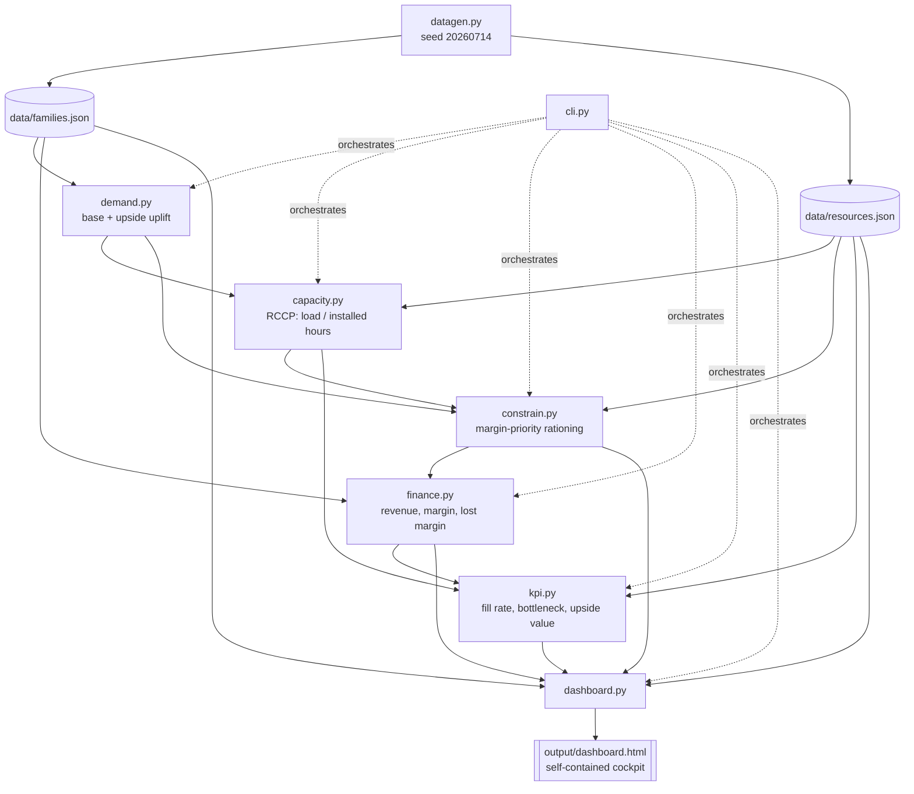

# Architecture

## Module map

## The dependency chain, in one paragraph

`datagen.py` is the only module that touches randomness (and only for a
±3% seeded jitter on top of a seasonal shape — everything else is
deterministic). Everything downstream reads plain dataclasses:
`demand.py` turns a `Family` list into a `DemandLine` list for one
scenario; `capacity.py` turns that into a `ResourceLoad` list (RCCP);
`constrain.py` turns demand + loads into a `SupplyLine` list (what
actually gets produced/shipped); `finance.py` turns supply lines into
`FinanceLine`/`FinanceSummary`; `kpi.py` turns all of the above into a
flat `dict[str, Kpi]` catalog. `cli.py` is the only module that calls
all of them in sequence (`run_scenario`/`run_all_scenarios`); `models.py`
is the only module every other module imports from.

## Why scenarios aren't threaded through as a parameter object

Every function that's scenario-aware takes `scenario: ScenarioId`
explicitly rather than a config object, and the CLI's
`run_all_scenarios` simply calls the same functions three times. This
keeps each engine module's contract narrow and testable in isolation
(see `tests/fixtures.py`'s hand-computable toy network, used identically
across `test_capacity.py`, `test_constrain.py`, `test_finance.py`, and
`test_kpi.py`) — there is no scenario-specific branching hidden inside
`demand.py` or `capacity.py` beyond a single `if scenario in
UPLIFT_SCENARIOS` check and a single `if scenario == ScenarioId.UPSIDE`
check, both in the modules whose whole job is to encode that
distinction (`demand.py` and `constrain.py` respectively).

## The dashboard context contract

`dashboard.build_context(...)` is the one function standing between the
engine and the renderer. It takes every scenario's loads, supply lines,
finance lines, and summary, plus the KPI catalog, and returns a single
JSON-serializable dict — `generated_at`, `company`, `kpis`, `resources`,
`families`, `scenarios` (keyed `base`/`upside`/`constrained`, each with
its own `summary`, per-resource `capacity` series, `monthly_totals`,
and `reconciliation` table rows), and `bottleneck`. `render_dashboard`
never recomputes anything — it only formats what's already in the
context dict. This is the same contract-first pattern used by
`kpi.compute_kpis`: the CLI's console tables and the dashboard's HTML
tiles read from the exact same computed objects, so they can never
silently disagree.

## Where output lands

`data/families.json` / `data/resources.json` are checked into the repo
(seeded, so re-running `datagen.write_data()` reproduces them
byte-for-byte) — they're the visible, browsable "ground truth" input.
`output/comparison.json` and `output/dashboard.html` are gitignored
(regenerated by `make demo`/`make dashboard`); only `output/.gitkeep`
is committed so the directory exists on a fresh clone.

Next: [S&OP → IBP Method](02-sop-ibp-method.md).
